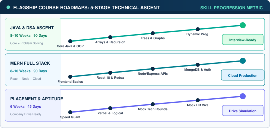
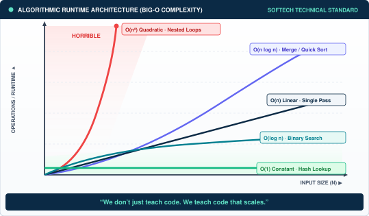

# 🗺️ Java + DSA Master Roadmap & Comprehensive Practice Suite

<div align="center">

  
  
  
  

  <p align="center">
    <strong>An end-to-end, production-grade curriculum for mastering Core Java and Data Structures & Algorithms.</strong><br />
    Features fully implemented, compilable standalone Java source modules, 15 core interview algorithmic patterns, and a 100+ LeetCode practice checklist.
  </p>

</div>

---

## 📸 Visual Roadmap & Curriculum Preview

<div align="center">
  
  <p><em>📌 <strong>Complete Structured Learning Path</strong> — from Java fundamentals to advanced algorithmic graph patterns and interview mastery.</em></p>
</div>

### 🗺️ 5-Stage Technical Ascent Roadmap
<div align="center">
  
</div>

### 📊 Algorithmic Runtime Architecture (Big-O Complexity)
<div align="center">
  
</div>

---

## 📋 Table of Contents
- [Visual Roadmap & Curriculum Preview](#-visual-roadmap--curriculum-preview)
- [Curriculum Architecture](#-curriculum-architecture)
- [4-Phase Learning Path](#-4-phase-learning-path)
  - [Phase 1: Core Java Foundations](#phase-1-core-java-foundations-01-core-java)
  - [Phase 2: Fundamental & Advanced Data Structures](#phase-2-fundamental--advanced-data-structures-02-data-structures)
  - [Phase 3: Classic & Optimization Algorithms](#phase-3-classic--optimization-algorithms-03-algorithms)
  - [Phase 4: FAANG & Enterprise Interview Preparation](#phase-4-faang--enterprise-interview-preparation-04-interview-prep)
- [Compilation & Execution Guide](#-compilation--execution-guide)
- [Author & Mentorship](#-author--mentorship)
- [License & Copyright](#-license--copyright)

---

## 📌 Curriculum Architecture

```text
JAVA-DSA-Roadmap/
├── assets/
│   ├── flagship_roadmaps.svg             # 5-Stage Technical Ascent Diagram
│   └── big_o_chart.svg                   # Big-O Complexity Runtime Architecture
├── 01-Core-Java/
│   ├── 01-Fundamentals/                  # Java Syntax, Variables, Control Flow, Loops (Basics.java)
│   ├── 02-OOPs-Concepts/                 # Encapsulation, Inheritance, Polymorphism, Abstraction (OOPsDemo.java)
│   └── 03-Collections-Framework/         # List, Set, Map, Queue, PriorityQueue (CollectionsGuide.java)
├── 02-Data-Structures/
│   ├── 01-Arrays-and-ArrayList/          # Array Manipulation, Two Pointers, Sliding Window (ArrayOperations.java)
│   ├── 02-LinkedLists/                   # Singly/Doubly Linked Lists, Cycle Detection (LinkedListDemo.java)
│   ├── 03-Stacks-and-Queues/             # Custom Array Stack, Linked Queue, Parentheses (StackQueueDemo.java)
│   ├── 04-Trees-and-BST/                 # Binary Trees, Traversals (Pre/In/Post/BFS) (BinaryTreeDemo.java)
│   ├── 05-Heaps-and-PriorityQueue/       # Custom MinHeap, Sift-Up/Down, Kth Largest (HeapDemo.java)
│   └── 06-Graphs/                        # Adjacency List, BFS, DFS, Dijkstra Shortest Path (GraphDemo.java)
├── 03-Algorithms/
│   ├── 01-Searching-Sorting/             # Binary Search, Merge Sort, Quick Sort (SortingAlgorithms.java)
│   ├── 02-Recursion-Backtracking/        # Subsets, Permutations, N-Queens Solver (RecursionBacktrackingDemo.java)
│   └── 03-Dynamic-Programming/           # 0/1 Knapsack, Coin Change, LCS, Tabulation (DynamicProgrammingDemo.java)
├── 04-Interview-Prep/
│   ├── Patterns.md                       # Top 15 Problem Solving Patterns & Templates
│   └── Problem-Set.md                    # 100+ Essential LeetCode Problem Checklist
├── LICENSE                               # MIT License
└── README.md                             # Comprehensive curriculum documentation
```

---

## 🚀 4-Phase Learning Path

### Phase 1: Core Java Foundations (`01-Core-Java/`)
- 💡 **Java Fundamentals**: Primitives vs reference types, scopes, operators, loops, string immutability (`Basics.java`).
- 🏗️ **Object-Oriented Architecture**: Class composition, abstract classes, interface contracts, polymorphism (`OOPsDemo.java`).
- 📦 **Collections Framework Deep-Dive**: Time complexities, iterators, `HashMap` hashing internals, `PriorityQueue` ordering (`CollectionsGuide.java`).

### Phase 2: Fundamental & Advanced Data Structures (`02-Data-Structures/`)
- ⚡ **Arrays & Resizable Arrays**: Static array manipulation, two-pointer scanning, sliding window algorithms (`ArrayOperations.java`).
- 🔗 **Linked Lists**: Node manipulation, fast & slow pointer cycle detection, in-place reversal (`LinkedListDemo.java`).
- 📚 **Stacks & Queues**: Custom fixed and dynamic implementations, LIFO/FIFO mechanics, expression evaluation (`StackQueueDemo.java`).
- 🌲 **Trees & Binary Search Trees**: Tree traversals (In-order, Pre-order, Post-order, Level-order BFS), BST insertion & validation (`BinaryTreeDemo.java`).
- 📊 **Heaps & Priority Queues**: Binary heap properties, heapify, sift-up/down operations, top-K selection (`HeapDemo.java`).
- 🌐 **Graph Theory**: Graph representations (Adjacency Matrix vs. List), BFS, DFS traversal, Dijkstra shortest path (`GraphDemo.java`).

### Phase 3: Classic & Optimization Algorithms (`03-Algorithms/`)
- 🔎 **Searching & Sorting**: Binary search boundaries, Merge Sort $O(N \log N)$ divide-and-conquer, Quick Sort partitioning (`SortingAlgorithms.java`).
- 🔄 **Recursion & Backtracking**: Exhaustive search spaces, pruning conditions, combinatorial subsets, permutations, N-Queens constraint satisfaction (`RecursionBacktrackingDemo.java`).
- 🧠 **Dynamic Programming**: Optimal substructure, overlapping subproblems, memoization vs. iterative tabulation, Knapsack, Coin Change, LCS (`DynamicProgrammingDemo.java`).

### Phase 4: FAANG & Enterprise Interview Preparation (`04-Interview-Prep/`)
- 🎯 **[Top 15 Problem Solving Patterns](04-Interview-Prep/Patterns.md)**: Sliding Window, Two Pointers, Fast & Slow Pointers, Monotonic Stack, Top-K, etc.
- 📝 **[100+ Curated LeetCode Checklist](04-Interview-Prep/Problem-Set.md)**: Tiered progression across Easy, Medium, and Hard problem tiers.

---

## 🛠️ Compilation & Execution Guide

All modules in this repository are pure, self-contained Java source files requiring zero third-party dependencies:

```powershell
# Clone the repository
git clone https://github.com/Pradeep-B28/JAVA-DSA-Roadmap.git
cd JAVA-DSA-Roadmap

# Run Stacks & Queues Demo
javac 02-Data-Structures/03-Stacks-and-Queues/StackQueueDemo.java
java -cp 02-Data-Structures/03-Stacks-and-Queues StackQueueDemo

# Run Binary Heap & Priority Queue Demo
javac 02-Data-Structures/05-Heaps-and-PriorityQueue/HeapDemo.java
java -cp 02-Data-Structures/05-Heaps-and-PriorityQueue HeapDemo

# Run Graph Traversals & Dijkstra Shortest Path
javac 02-Data-Structures/06-Graphs/GraphDemo.java
java -cp 02-Data-Structures/06-Graphs GraphDemo

# Run Dynamic Programming Suite
javac 03-Algorithms/03-Dynamic-Programming/DynamicProgrammingDemo.java
java -cp 03-Algorithms/03-Dynamic-Programming DynamicProgrammingDemo
```

---

## 👨‍🏫 Author & Mentorship

Developed and maintained by **Pradeep** — Master Trainer & Software Architect.

- 🌐 **Portfolio**: [https://pradeep-b28.github.io/Pradeep-B28/](https://pradeep-b28.github.io/Pradeep-B28/)
- 💼 **LinkedIn**: [linkedin.com/in/pradeepb-2k](https://www.linkedin.com/in/pradeepb-2k)
- 📧 **Email**: [pradeepbashaa@gmail.com](mailto:pradeepbashaa@gmail.com)

---

## 📄 License & Copyright

```
Copyright (c) 2026 Pradeep (Pradeep-B28). All Rights Reserved.

Licensed under the MIT License. You may freely use, modify, and distribute
this project under the terms of the MIT license. See the LICENSE file for details.
```
